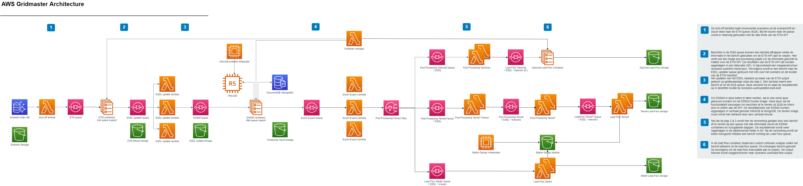
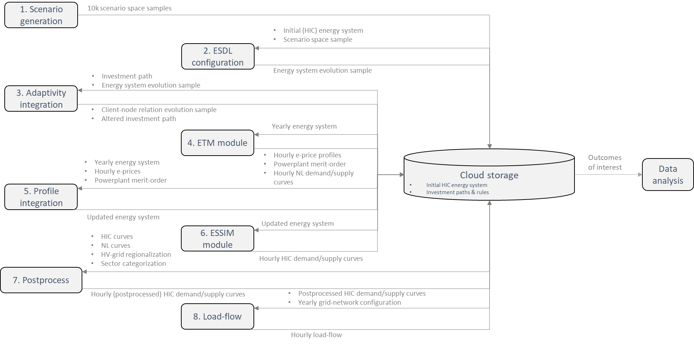

# Gridmaster-lambda-chain

This project contains the partial source code for the Gridmaster Simulation project. This repository contains all the serverless code which was used. Due to confidentiality, configuration files about the network layout were removed. Therefore, this repository will not run out of the box. The folder structure of the repository is as follows:

- 01_kick_off - Code for the kick-off Lambda function.
- 02_esdl_updater - Code for the ESDL updater Lambda function.
- 03_essim_export - Code for the ESSIM exporter Lambda function.
- 04_post_processing_fanout - Splits the tennet flow into 1 message per network model
- 05_post_processing_tennet - Code for the post processing of TenneT Lambda function.
- 06_post_processing_gasunie - Code for the post processing of GasUnie Lambda function.
- 07_loadflow_tennet - Code for the tennet loadflow Lambda function.
- 08_loadflow_stedin - Code for the stedin loadflow Lambda function.
- 09_gasunie_metrics - Code for the GasUnie Metrics calculation lambda function.
- 98_pandas_layer - Python package layer for running the tennet loadflow/postprocessing
- 99_container_manager - Code for the container manager Lambda function.
- template.yaml - Template that defines the application's AWS resources.
- samconfig.toml - AWS SAM configuration file for deployment.

For detailed narratives on each folder, please refer to the Gridmaster report that can be found on [the Gridmaster website](https://gridmaster.nl/).

The application uses several AWS resources, including Lambda functions. These resources are defined in the `template.yaml` file in this project. The architecture used within this project is as follows:



This architecture also includes parts which are not within this repository, but can be found in the other repositories in this account.

## Deploy the application

The Serverless Application Model Command Line Interface (SAM CLI) is an extension of the AWS CLI that adds functionality for building and testing Lambda applications. It uses Docker to run your functions in an Amazon Linux environment that matches Lambda. It can also emulate your application's build environment and API.

To use the SAM CLI, you need the following tools.

- SAM CLI - [Install the SAM CLI](https://docs.aws.amazon.com/serverless-application-model/latest/developerguide/serverless-sam-cli-install.html)
- [Python 3 installed](https://www.python.org/downloads/)
- Docker - [Install Docker community edition](https://hub.docker.com/search/?type=edition&offering=community)

To build and deploy your application for the first time, run the following in your shell:

```bash
sam build --use-container
sam deploy
```

The first command will build the source of your application. The second command will package and deploy your application to AWS, with the following information from the samconfig.toml:

- **Stack Name**: gridmaster-event-chain
- **AWS Region**: eu-central-1
- **Confirm changes before deploy**: If set to yes, any change sets will be shown to you before execution for manual review. If set to no, the AWS SAM CLI will automatically deploy application changes.

## Use the SAM CLI to build and test locally

Build your application with the `sam build --use-container` command.

```bash
sam build --use-container
```

The SAM CLI installs dependencies defined in `{codeUri}/requirements.txt`, creates a deployment package, and saves it in the `.aws-sam/build` folder.

Test a single function by invoking it directly with a test event. An event is a JSON document that represents the input that the function receives from the event source. Test events are included in the `events` folder in this project.

Run functions locally and invoke them with the `sam local invoke` command.

```bash
sam local invoke KickOff --event events/event.json
```

## Functional design

A high-level schematic overview of the designed multi-model is shown below. The submodels are sequentially executed as indicated with their respective number. The produced data of a submodel is collected in the cloud storage. Part of this data can be used as input for a simulation with another submodel.



The simulation is initiated by running submodels 1 and 2 which generates and stores all input scenario's (i.e. energy system evolution samples) from the scenario space sample in the cloud respectively.Subsequently, all submodels from 3 to 8 are sequentially executed per scenario. Every simulation run starts with an input scenario (i.e. energy system evolution sample) and an input investment path. This input data is used by the other submodels which results in the final hourly overload values for energy infrastructure elements per reference year by sequential computations with the submodels.

## Resources

See the [AWS SAM developer guide](https://docs.aws.amazon.com/serverless-application-model/latest/developerguide/what-is-sam.html) for an introduction to SAM specification, the SAM CLI, and serverless application concepts.

## Other Gridmaster tooling

The public results of the multi-model simulations are published with Tableau and can be accessed through the following link: [Access visualization tool](https://public.tableau.com/app/profile/gridmaster2022)
